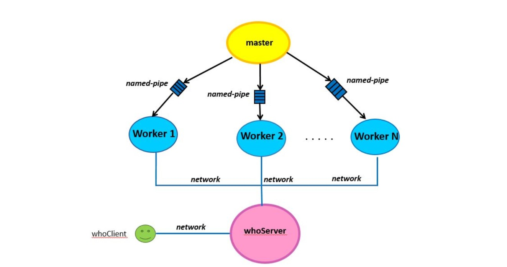

# k24-hw3-spring-2020

### General description 

Client server application handling patiend record data. Consists of the following processes
 - **whoServer**  
 - **whoClient** 
 - **master** 
 - **worker**

Patiend data are stored where master and worker proccesses are being run. whoClient sends queries to whoServer, whoServer forwards these queries to the worker processes if needed, then waits for their response, and finally sends the response back to whoClient. whoServer is a multi threaded process which assigns each new incoming connection to a thread. whoClient is also a multi threaded process which assigns each query to a thread. For a more detailed description, see `./hw3-spring-2020.pdf`.

### Graphical representation

The graph below depicts the interactions between the processes.

  
### Order of execution

  **whoServer** runs first. Sets up sockets and listens on both ports assigned. Creates threads, and enters _"server mode"_, meaning waiting for a new connection and when arrived, places fd in pool. Threads wait to get a file descriptor. 
  
  **master** runs second. Reads input directory, forks workers and assigns them countries. Then pauses, waiting for a signal. On SIGINT or SIGTSTP, he sends SIGINT to workers, prompting them to exit, waits for them and then exits himself. 
  
  **worker** connects to whoServer, reads countries assigned, and sends summary statistics to whoServer. Then waits on `receive_id()`, meaning waiting in case whoServer needs to answer to a `/searchPatientRecord` command. That is the only command in which whoServer communicates with workers. All others are answered using the summary statistics. This was my design in hw2 and I kept it the same way.
  
  When **whoServer** receives a new connection from statisticsPortNum, a thread picks it up, updates global data structures (same as hw2), and then stores file descriptor corresponding to the worker connection. That way the connection is not closed and when whoServer needs to communicate with workers, he iterates over the set of worker file descriptors.
  
  **whoClient** runs next assigning each thread a line from `queries.txt`. Note that the parameter `numThreads` must be less or equal to the number of lines in `queries.txt`. A thread will connect to whoServer, send the query assigned to whoServer, wait for the answer and then print them both.
  
  **whoServer** exits normally on SIGINT or SIGTSTP, meaning freeing apporpiately all resources.

### Compilation
  From the root project directory, type `make`.
  
### Run
  - **master:** From the root project directory, type `/bin/master`.
  - **whoServer:** From the root project directory, type `/bin/whoServer`.
  - **whoClient:** From the root project directory, type `/bin/whoClient`.
  - **create_infiles.sh:** From the root project directory, type `scripts/create_infiles.sh`.

### Notes
  - For date files in the `dd-mm-yyyy` or the `(d)d-(m)m-yyyy` format, set the appropriate macro at the begining of `include/myDate.h` file. By default, the `(d)d-(m)m-yyyy` is used, because the script `create_infiles.sh` creates date files in that format. 
  - The serverIP parameter is in dotted decimal notation.

### Author
  Michalis Vargiamis
